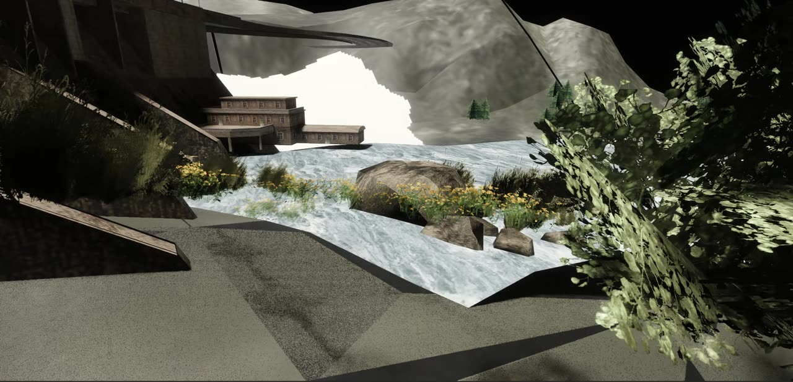
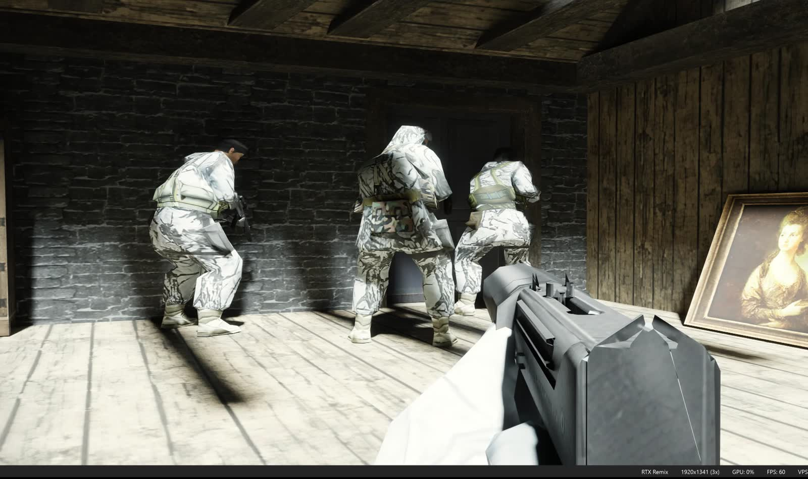
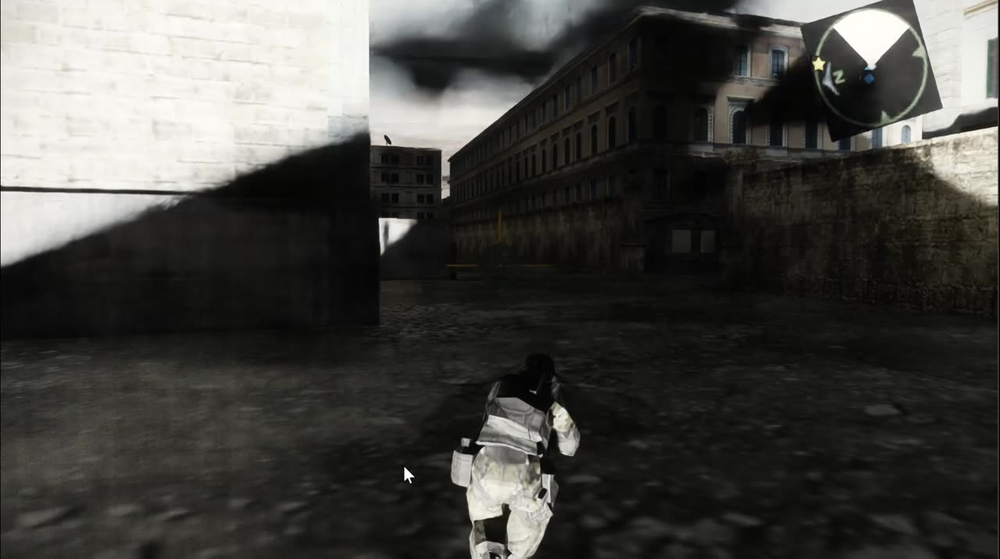

# PCSX2 with a native RTX Remix render backend

This is a fork of [PCSX2](https://github.com/PCSX2/pcsx2) that adds a **render backend which
submits PlayStation 2 geometry to the RTX Remix runtime through the Remix API**, so a PS2 title is
path traced rather than rasterised.

It is not a d3d9 wrapper and there is no proxy DLL in the chain. The backend calls `remixapi_*`
directly -- it creates meshes, materials, instances, lights and a camera, and hands them to the
runtime every frame. That matters here because the usual way a game reaches Remix is by having its
fixed-function D3D9 calls intercepted, and **the PlayStation 2 has no fixed-function transform unit
to intercept**. There is no `SetTransform` to read a view matrix out of. The view-projection lives
inside a VU1 microprogram that the game uploaded, so the backend has to recover it from the
microcode itself; see [How the camera is recovered](#how-the-camera-is-recovered).

The sibling project is [rpcs3-rtx](https://github.com/BRAGme/rpcs3-rtx), the same idea for
PlayStation 3 / RSX. That one is further along.

Everything about the base emulator -- compatibility, BIOS requirements, controllers, the rest of it
-- is unchanged and is documented in
[upstream's README](https://github.com/PCSX2/pcsx2/blob/master/README.md).

---

## Requirements

**This fork does not work with the stock NVIDIA RTX Remix runtime.** It requires a dxvk-remix
fork on the extended API line -- Remix Plus, or a build derived from it:

| | |
|---|---|
| Requirement | any dxvk-remix fork on the `0.1000.x` API line that exports `remixapi_CreateTexture` |
| Known-good source | [`RemixProjGroup/dxvk-remix`](https://github.com/RemixProjGroup/dxvk-remix), maintainer Kim2091 |
| Release tag | `remix-plus-1.5.1` (tag object `f4173a9c8b94736363cb27c3bd228059780acbcf`), asset `Remix_Plus_v1.5.1_x64_games_release.zip` |
| API version | `0.1000.0` (the vendored `remix_c.h:65-67`) |

**What the measurements in this README were actually taken on is not that tag.** The deployed
runtime on the development machine reports `dxvk-remix (remix-main+abbae23d)` and carries the
string `remix-numos3` -- a numos3 build, not Remix Plus 1.5.1. Both sit on the same API line
(numos3's header is `0.1000.1`, ours is `0.1000.0`, and the handshake only breaks on the minor),
so either should connect, but only the numos3 build has run this backend for any length of time.
Treat 1.5.1 as expected-to-work rather than verified, and if you see behaviour this README does
not describe, the runtime is the first variable to change.

Two independent reasons stock will not do:

1. **The version handshake rejects it.** Remix Plus reserves `REMIXAPI_VERSION_MINOR = 1000`
   (`pcsx2/GS/Remix/remix_c.h:58-67`) and the compatibility check treats every minor as breaking
   while `MAJOR == 0`. Stock dxvk-remix is on the `0.6.x` line, so the two refuse each other rather
   than running with mismatched struct layouts and category bits.
2. **`remixapi_CreateTexture` does not exist in stock.** The backend needs to hand the runtime
   texture data it decoded from PS2 memory; there is no on-disk file to point at.

The vendored `pcsx2/GS/Remix/remix_c.h` is never hand-edited -- it is copied wholesale from the
runtime fork's `public/include/remix/remix_c.h`, in the same commit that changes the deployed
runtime. A single missed struct member silently misroutes every interface slot after the
divergence, which fails at runtime rather than at build time.

### Installing the runtime

The backend looks for the runtime DLL in this order (`pcsx2/GS/Remix/RemixPaths.cpp:233-247`):

1. `PCSX2_REMIX_DLL`, if set, used verbatim;
2. the `RuntimePath` value under `[Remix]` in the settings;
3. `<install>\remix\d3d9.dll`.

So unzip the Remix Plus release into a `remix\` **subfolder** alongside `pcsx2-qtx64.exe`, giving
you `<install>\remix\d3d9.dll`. **Do not drop `d3d9.dll` directly next to the executable.** A file
by that name there gets picked up by anything else in the process that resolves it, which is
precisely the failure the explicit subdirectory exists to avoid.

---

## What it looks like

All three stills are frames lifted from screen captures on this branch. Emulator captures date fast
and this branch moves several times a day, so each one is labelled with **when it was captured and
what the branch tip was at that moment**. Nothing here is a render of a build that does not exist.



*Tom Clancy's Ghost Recon 2 (SLUS-21105). Captured 2026-08-08 08:58; branch tip `b87dc8e8f`.
Textures, vertex normals and path-traced lighting; the near-black sky is the game's own.*



*A different title, Tom Clancy's Rainbow Six 3 (SLUS-20883), captured 2026-08-08 08:24; branch tip
`37a25ae09` at that moment. Albedo on
brick, plank and the framed oil painting; character models with their own textures; contact shadows
and the light shaft are the path tracer, not baked. The status bar bottom right is the emulator's
own -- `RTX Remix` names the active renderer, at 60 fps. The Remix developer menu was open during
this capture and has been cropped out of the right edge.*



*SOCOM: U.S. Navy SEALs -- Combined Assault (SCUS-97545). Captured **2026-08-02 23:11**, branch tip
**`a311a7c5d`** -- six days and ~30 commits before the current tip. **This is not a picture of the
current build.** SOCOM has not been re-verified since; see the status table. The floating compass
in the top right is the world-space UI problem, not a Remix artefact.*

**Video:** [Ghost Recon 2 under the backend, 13 s, 22 MB](https://github.com/BRAGme/pcsx2-rtx-remix/releases/download/remix-preview-1/pcsx2-rtx-remix-ghost-recon-2.mp4)
-- the same capture the first still is from, so the same date and branch tip apply. It is a release
asset rather than an embed, so the link downloads rather than streams. Audio is stripped: the source
capture carries two tracks and one of them is a microphone.

---

## Current status

Read this before building anything. The backend renders, and it is not finished.

### What has been seen working

| Title | Serial | What was verified | When, and on what |
|---|---|---|---|
| Tom Clancy's Ghost Recon 2 | `SLUS-21105` | World geometry, albedo textures, generated vertex normals, path-traced lighting | Capture 2026-08-08 08:58, branch tip `b87dc8e8f` |
| Tom Clancy's Rainbow Six 3 | `SLUS-20883` | World geometry, albedo textures, characters, path-traced lighting | Capture 2026-08-08 08:24, branch tip `37a25ae09` |
| SOCOM: U.S. Navy SEALs -- Combined Assault | `SCUS-97545` | World geometry, albedo textures, characters, path-traced lighting | Capture 2026-08-02 23:11, tip `a311a7c5d` -- **not re-verified since** |

SOCOM is listed honestly rather than confidently. Between `a311a7c5d` and the current tip the
material path was rewritten several times over (`8f229137d`, `1952014f4`, `64d2b28f0`,
`870e3f991`), and the device loss below makes SOCOM expensive to get into a mission at all, so it
has not had a clean re-measurement. Assume it needs one. No other title has been measured; absence
from this table means untested, not broken.

Landed since that table was written, each measured on the title named:

| What | Where it was measured |
|---|---|
| **The flat-albedo defect was an enum bug, not texture binding.** D3D9 enum values were being written into fields the runtime casts straight to `VkBlendFactor` / `RtTextureArgSource`; `textureColorArg1Source = 2` meant `D3DTA_TEXTURE` to us and `VertexColor0` to the runtime, so the backend asked for vertex colour and ignored the texture. `MODULATE` also read as `Modulate2x`, doubling surface brightness. | `dc6a1934b`, all titles |
| **The 1-in-3 "flickering triangles" is an empty present window**, not depth precision: the game renders below the vsync rate, so every Nth presented window submits zero geometry. `PCSX2_REMIX_HOLDEMPTY` re-presents the previous window. Period-3 luma signature gone; `offcadence 0` over 14,098 holds. | `f1561a731`, Combined Assault and SOCOM 1 |
| **PS2 text is drawn as sprites**, and the first classification gate returned on any non-triangle primclass ~900 lines before the UI classifier could see it, discarding all of it. | `dc6a1934b`, all titles |
| **USD capture was broken for every game by a locale bug.** PCSX2 calls `std::locale::global(std::locale(""))`; the runtime builds prim names with a bare `stringstream`, so hex hashes came out comma-grouped and are invalid USD identifiers. Every capture failed 18 ms in. | `29ddee4a4`; capture now yields 3 meshes / 37 materials / 71 textures on Alcatraz |
| **The camera is read out of EE memory** on Rainbow Six 3 rather than recovered from VU1. Verified live: position tracks a multi-thousand-unit walk, yaw follows every turn, Z steps on stairs. | `dc6a1934b` / `02e549e70`, Rainbow Six 3 |
| **The synthetic projection was never validated**, because geometry re-projects to the guest's own clip whatever FOV we use -- only a world-space light exposes the error. `LIGHTFIT` measured the residual between an authored lamp and its fixture: 14.0 units at fov 60, **1.4 at fov 70**. | `1261786e4`, Rainbow Six 3 |
| **The ghost bodies are the game's shadow pass** -- characters re-rendered from the light's viewpoint, which un-project into duplicate bodies drifting through walls. 1.3% of draws carrying 24% of the vertices. `PCSX2_REMIX_SHADOWPASS` drops them. | `1261786e4`, Rainbow Six 3 |
| **Sky is classified by depth, not draw ordinal.** Combined Assault's backdrop is draw 982 of 999, so an ordinal gate could never reach it; what the ordinal *did* catch was near-field terrain, which is worse than doing nothing. | `15d12352f`, Combined Assault |

### Known blockers

**One camera per frame, applied to every draw.** The backend picks a single view-projection and
uses it for the whole frame. Per-draw camera association is not built. It is measurable: on
Rainbow Six 3 save state 9 the frames that anchor to world space run at 99.84%, but on save state 7
-- which runs a *different* VU1 microprogram emitting roughly 20,000 distinct candidate matrices in
30 s -- three 30 s runs measured 35.3%, 48.4% and 68.3% (`9c271c790`). The rest fall back to view
space.

*Partly superseded for one title.* On Rainbow Six 3 the camera is no longer recovered from VU1 at
all -- it is read directly out of EE memory (`dc6a1934b`, `02e549e70`), which sidesteps the
candidate-set problem entirely for that game. The VU1 recovery path below is still what every other
title uses, and the per-draw limitation still stands everywhere. Worth knowing why: `VIFMAP`, a
write-side probe over 7.8M VIF1 unpacks, found 360 distinct upload shapes and **none** that writes
a standalone matrix once per frame. The EE composes per-object MVPs and ships only the product, so
on that title no pin, slice, TOPS bank or ranking change could ever have recovered a view
transform. If a title resists the VU1 path, that is the first thing to check.

**Reproducible device loss (`0x60D0DEAD`) on some titles.** On SOCOM the hang lands within a
fraction of a second of the renderer going live, and loading heavy mission geometry is what
triggers it. This is not tuneable from the harness side -- four different entry strategies were
measured and the ceiling is the crash, not the navigation. The measurements are written up in
[`tools/remix-harness/README.md`](tools/remix-harness/README.md).

**Vertex explosions on some draws.** Geometry occasionally lands at runaway positions and reads as
white shards across the frame. `PCSX2_REMIX_POSLIMIT` drops vertices past a distance threshold as a
blunt mitigation; the underlying decode is not fully solved.

**A binary build is available** -- see [Releases](https://github.com/BRAGme/pcsx2-rtx-remix/releases).
Everything above is still true of it: it is a research build, not a finished one. It does not include
the Remix Plus runtime or a PS2 BIOS; both are described in the zip's `SETUP.txt`. Building from
source is still documented below, and the packaging list is `tools/package-release.sh`.

---

## How the camera is recovered

This is the part worth stealing if you are doing the same thing for another emulator.

RTX Remix needs a camera: a view-projection matrix, per frame, in a coordinate system the runtime
can reason about. On PC titles this is nearly free, because a fixed-function D3D9 game *tells* the
driver its view and projection matrices through `SetTransform`, and a Remix-style interposer just
reads them. **The PlayStation 2 has no such call.** The GS -- the part of the console that a
graphics API would correspond to -- consumes vertices that are already in screen space. Everything
upstream of that, including the entire transform, happens in VU1, a vector unit running a
microprogram the game uploaded at some earlier point. There is no API surface. There is a 16 KB
block of vector memory and a program you did not write.

The first approach was the obvious one: scan VU1 data memory for 16-float windows that look like a
projection matrix, and score them. It half-works and it is miserable. A frame produces on the order
of a thousand plausible windows, most of them reinterpreted pointers or packed integer data that
happens to decode as finite floats, and the scoring is a heuristic argument about shape with no
ground truth behind it.

The backend now does something deterministic instead: **a back-slice of the VU1 microcode itself**.
The transform in a VU program is not arbitrary; it is the canonical matrix-vector product, and on
VU1 it is written one way:

```
MULAx   ACC,     VF[m0], VF[v]x
MADDAy  ACC,     VF[m1], VF[v]y
MADDAz  ACC,     VF[m2], VF[v]z
MADDw   VF[out], VF[m3], VF[v]w
```

Two properties make that decodable rather than merely plausible. First, **the broadcast field names
the matrix row directly** -- the operand broadcast by component *i* is row *i* -- so row order
comes out of the instruction encoding and not out of the order the instructions happen to appear
in. Second, **back-slicing the load that last wrote each `VF[mi]`** (`LQ`, `LQI` or `LQD`) yields
that row's address in VU1 data memory. Do that for all four rows and you have not scored a guess:
you have the address the matrix lives at, derived from the program that uses it.

From there the backend walks forward. A chain whose result is later `CLIP`ped is in clip space; a
chain whose result feeds a `DIV` is the perspective divide. Those two facts identify which of the
several matrix chains in a microprogram is the view-projection, as opposed to a bone palette or an
object placement. The recovered address is then re-read at each `XGKICK` -- the instruction that
hands a completed primitive buffer to the GS -- so the matrix that is read is the one the program
was actually using when it submitted geometry, and it stays valid as the game animates it.

The encodings are pinned to PCSX2's own tables (`microVU_Tables.inl`, `microVU_Misc.h`,
`VU1microInterp.cpp`) rather than to documentation, so a change in how PCSX2 decodes VU1 cannot
silently desynchronise the slicer. The design and the exact table references are in
[`pcsx2/GS/Remix/RemixVU1Slice.h`](pcsx2/GS/Remix/RemixVU1Slice.h); the per-frame capture and
candidate ranking are in
[`pcsx2/GS/Remix/RemixVU1Capture.cpp`](pcsx2/GS/Remix/RemixVU1Capture.cpp).

What is *not* solved is selection. A title can run several microprograms and emit thousands of
distinct matrices per frame, and the backend still has to choose one per frame -- see the blocker
above. The recovery is deterministic; the choice among recoveries is not yet.

Worth noting for anyone porting the idea: RPCS3's `match_mad_chain` uses the same broadcast-names-
the-row trick on RSX vertex programs, and VU1's `_bc_` field maps onto it almost exactly. The
technique generalises better than the console-specific plumbing around it does.

---

## Building

Windows, Visual Studio 2022, x64.

### Get the dependencies first

**This is the step people miss, and the error does not look like a missing step.** A fresh
clone does not build. MSBuild resolves every third-party library from `$(SolutionDir)deps\`
(`common/vsprops/DepsDir.props:4`), and `deps/` is gitignored (`.gitignore:118-119`) because it is
*obtained*, not committed. Build the `sln` without it and you get a wall of `C1083` misses --
`zlib.h`, `zstd.h`, `ft2build.h`, `jpeglib.h`, `ryml.hpp`, `directx/d3d12.h` and more. That is
every third-party library at once, not one broken vendored copy, and it is upstream PCSX2
behaviour rather than anything this fork introduced.

There are no git submodules. `.gitmodules` is empty and upstream moved every vendored library
in-tree, so `git submodule update` will appear to do nothing. That is correct, not a failed clone,
and it is the first false lead to skip.

**Fastest route -- download the prebuilt package.** Upstream publishes one:

1. Get `pcsx2-windows-dependencies.7z` (~142 MB) from
   [`PCSX2/pcsx2-windows-dependencies`](https://github.com/PCSX2/pcsx2-windows-dependencies/releases/tag/latest-windows-dependencies),
   tag `latest-windows-dependencies`.
2. Extract it **at the repo root**. The archive already contains a top-level `deps` folder, so you
   end up with `<repo>\deps\` and nothing to rename.

Verified on 2026-08-31: a clean clone of this branch plus that archive builds
`PCSX2_qt.sln` to exit 0 with no errors, producing a `pcsx2-qtx64.exe` carrying the full Remix
backend. The package is dated 2026-07-27 and upstream last changed a pinned dependency version on
2026-07-20, so it is current for this fork -- the only edits this fork makes to the dependency
script are two 7-Zip extraction exclusions, which change no versions.

**Or build them yourself**, which is what CI does and what you need if the prebuilt package ever
falls behind:

```bat
.github\workflows\scripts\windows\build-dependencies.bat
```

It compiles ~28 libraries (Qt 6.11.1, zlib 1.3.2, libpng, FFmpeg, freetype, harfbuzz, shaderc,
KDDockWidgets and the rest) into `deps\`. Expect it to take a long while -- it is building Qt from
source. It hardcodes these tool paths (`build-dependencies.bat:26-28`), so they have to exist:

| Tool | Path the script expects |
|---|---|
| Visual Studio 2022 | located via `vswhere`; VS2022 is preferred over VS2026 |
| 7-Zip | `C:\Program Files\7-Zip\7z.exe` |
| Git for Windows | `C:\Program Files\Git\usr\bin\` (`patch.exe`, `bash.exe`) |
| CMake, Ninja, Python | on `PATH` |

### Then build the emulator

This is what [`tools/remix-harness/build.cmd`](tools/remix-harness/build.cmd) has always run:

```bat
call "C:\Program Files\Microsoft Visual Studio\2022\Community\VC\Auxiliary\Build\vcvars64.bat"
cd <repo>
msbuild PCSX2_qt.sln /m /v:m /p:Configuration=Release /p:Platform=x64
```

Nothing extra is needed for the Remix backend itself beyond the runtime, which is loaded at run
time and is not a build dependency.

The CMake presets in `CMakePresets.json` want `clang-cl`, which is not installed on the machine
this fork is developed on, so **the CMake path is untested here**. Use the `sln`.

Select the backend in *Settings -> Graphics -> Renderer*. Remix is renderer index 16 if you are
setting it from `bin\inis\PCSX2.ini` directly, which is what the test harness does.

---

## Running, and per-game configuration

Remix settings live in the GUI on their own page
(`pcsx2-qt/Settings/RemixSettingsWidget.{h,cpp,ui}`).

Per-game Remix settings go in `bin/<serial>.conf`. Six are tracked. The first two are the
curated ones, written up from measurements taken on those titles; the rest are transplants and say
so in their own headers:

| File | Title | Status |
|---|---|---|
| [`bin/SCUS-97545.conf`](bin/SCUS-97545.conf) | SOCOM: Combined Assault | measured on this title |
| [`bin/SLUS-20883.conf`](bin/SLUS-20883.conf) | Rainbow Six 3 | measured on this title |
| [`bin/SCUS-97134.conf`](bin/SCUS-97134.conf) | SOCOM: U.S. Navy SEALs | sky and `MINRT` measured here; the rest transplanted |
| [`bin/SCUS-97275.conf`](bin/SCUS-97275.conf) | SOCOM II | transplanted from Combined Assault, unmeasured here |
| [`bin/SCUS-97474.conf`](bin/SCUS-97474.conf) | SOCOM 3 | starter profile, unmeasured |
| [`bin/SCUS-97399.conf`](bin/SCUS-97399.conf) | God of War | starter profile, unmeasured, different engine |

None of them arms a diagnostic. If you are adding a profile, keep it that way -- `DRAWDUMP` and
friends default to 0 and belong in a working copy, not in the repo.

These are read at frame boundaries and pushed through `remixapi_SetConfigVariable`, which writes
Remix's **user** layer -- so they outrank `rtx.conf` and any Logic-graph layer. Keys spelled
`PCSX2_REMIX_*` set this backend's own knobs instead of Remix's. **An environment variable that is
already set always beats the file**, which is deliberate: it keeps A/B harnesses authoritative over
whatever the GUI last wrote.

Read the two curated files even if you do not play those games. They are written in the house style --
measured numbers rather than adjectives -- and they record *why* each setting is what it is. For
example, volumetric fog was not dimming SOCOM but hiding it: with volumetrics on, 2,502,313 lit
pixels at a uniform grey and 0.00% coloured; with them off, 26,874 lit pixels and 34.31% coloured.

Runtime-generated per-game state (Remix logs, captures, mods) goes to `bin/RemixGames/<serial>/`,
which is gitignored.

### Knobs

The backend has 60 tuning knobs, each settable three equivalent ways: the environment variable
`PCSX2_REMIX_<name>`, the settings key `[Remix]/<name>`, or the GUI page.

**[`docs/Remix/KNOBS.md`](docs/Remix/KNOBS.md)** is the full reference -- name, type, default,
range and effect, grouped. It is generated from the table in `pcsx2/GS/Remix/RemixKnobs.cpp`, which
is the single declaration the GUI and the environment bridge both read, so a knob cannot be wired
to the wrong variable and the default shown in the GUI cannot drift from the default the backend
applies.

### Test harness

[`tools/remix-harness/`](tools/remix-harness/README.md) holds the measurement scripts: an
equal-wall-time A/B runner over two builds, capture and image-metric tools, and a scripted route
into a SOCOM mission that survives the startup window the GPU hang lives in. Its README is also
where the traps are written down -- black `PrintWindow` captures, signed exit codes, zombie
processes that make a crashed run look like a survival. Worth reading before trusting any
measurement from this fork, including the ones quoted above.

---

## License and credits

GPL-3.0, unchanged from upstream. This fork adds files under `pcsx2/GS/Remix/`,
`pcsx2-qt/Settings/Remix*`, `tools/remix-harness/` and `docs/Remix/`; everything else is PCSX2's.

- **[PCSX2](https://github.com/PCSX2/pcsx2)** and its contributors -- the emulator this is a fork
  of, and the source of everything that is not the Remix backend.
- **[NVIDIA RTX Remix](https://github.com/NVIDIAGameWorks/rtx-remix)** -- the runtime and the API
  this targets.
- **[Remix Plus](https://github.com/RemixProjGroup/dxvk-remix)** (maintainer Kim2091) -- the
  dxvk-remix fork this pins, without whose `remixapi_CreateTexture` and extended API surface none
  of this would be possible.

Bugs here are this fork's, not upstream's. Please do not take PCSX2 issues about the Remix
renderer to the PCSX2 project.

### Provenance

Development on this branch is AI-assisted: work is done with Claude and the commits carry a
`Co-Authored-By` trailer (earlier ones an `(AI-assisted)` subject suffix). The code, the decisions
and the measurements are owned by a human, and every performance or behaviour claim in this README
and in the commit log is backed by a number that was actually measured on this machine -- which is
also why the status table above says "not re-verified" where that is the truth.
